# 🏛️ Blockchain Land Registry System

## 📋 Table of Contents
- [Overview](#overview)
- [Development Methodology](#development-methodology)
- [System Design & Architecture](#system-design--architecture)
- [Technology Stack](#technology-stack)
- [Core Features](#core-features)
- [System Flowcharts](#system-flowcharts)
- [Database Schema](#database-schema)
- [API Documentation](#api-documentation)
- [Setup & Installation](#setup--installation)
- [Project Structure](#project-structure)
- [Security Features](#security-features)

---

## 🎯 Overview

A comprehensive blockchain-based land registry system that digitizes land records, enables secure property transactions, and provides a marketplace for buying/selling land. The system combines traditional web technologies with blockchain for immutability and transparency.

### Key Highlights
- **Blockchain Integration**: Ethereum smart contracts for immutable land records
- **AI-Powered Chatbot**: Hybrid rule-based NLP + optional AI API for property search
- **Real-time Communication**: Socket.io-based chat between buyers and sellers
- **Secure Authentication**: JWT + 2FA with email OTP
- **Document Management**: GridFS for storing land documents and images
- **QR Code Verification**: Quick land record verification via QR scanning

---

## 📐 Development Methodology

### Software Development Life Cycle (SDLC)

This project follows an **Agile-Iterative** development approach with blockchain integration:

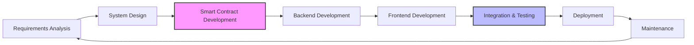

### Development Phases

#### **Phase 1: Requirements & Planning**
- ✅ Identified stakeholders (Admin, Users, Auditors)
- ✅ Defined functional requirements
- ✅ Blockchain feasibility analysis
- ✅ Technology stack selection

#### **Phase 2: System Architecture Design**
- ✅ Microservices architecture planning
- ✅ Database schema design
- ✅ Smart contract specification
- ✅ API endpoint design
- ✅ Security architecture

#### **Phase 3: Smart Contract Development**
- ✅ Solidity contract creation
- ✅ Unit testing with Hardhat
- ✅ Gas optimization
- ✅ Security audit
- ✅ Deployment scripts

#### **Phase 4: Backend Development**
- ✅ Express.js server setup
- ✅ MongoDB integration
- ✅ Blockchain service layer
- ✅ Authentication & authorization
- ✅ RESTful API development
- ✅ Socket.io real-time features

#### **Phase 5: Frontend Development**
- ✅ React + TypeScript setup
- ✅ Component architecture
- ✅ State management
- ✅ UI/UX design implementation
- ✅ Responsive design

#### **Phase 6: Integration & Testing**
- ✅ End-to-end testing
- ✅ Blockchain integration testing
- ✅ Security testing
- ✅ Performance optimization

#### **Phase 7: Deployment & Maintenance**
- ✅ Local deployment (Ganache)
- 🔄 Production deployment (planned)
- 🔄 Continuous monitoring
- 🔄 Bug fixes & updates

### Design Principles

1. **Separation of Concerns**
   - Frontend, Backend, Blockchain as independent layers
   - Modular component design
   - Service-oriented architecture

2. **Security First**
   - Blockchain immutability
   - JWT authentication
   - Input validation
   - Role-based access control

3. **Scalability**
   - Stateless backend design
   - Database indexing
   - Efficient blockchain queries
   - Caching strategies

4. **User Experience**
   - Intuitive UI/UX
   - Real-time feedback
   - AI-powered assistance
   - Responsive design

5. **Maintainability**
   - Clean code practices
   - Comprehensive documentation
   - Version control (Git)
   - Modular architecture

---

## 🏗️ System Design & Architecture

### High-Level Architecture

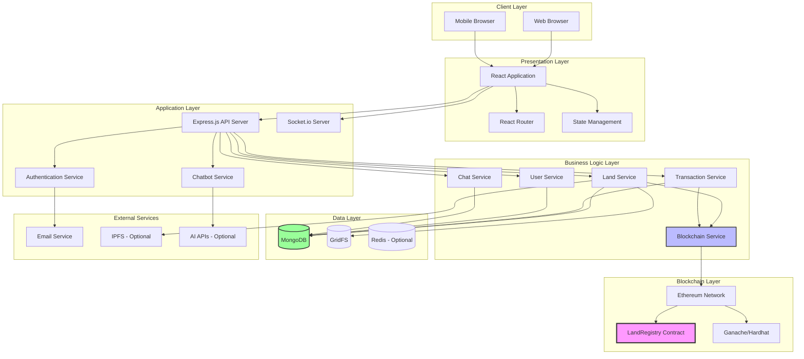

### Detailed Component Architecture

```mermaid
graph TB
    subgraph "Frontend Components"
        APP[App.tsx]
        DASH[Dashboard]
        MARKET[Marketplace]
        LAND_DETAIL[Land Detail Page]
        CHATBOT_WIDGET[Chatbot Widget]
        CHAT_UI[Real-time Chat]
        AUTH_UI[Auth Components]
        
        APP --> DASH
        APP --> MARKET
        APP --> LAND_DETAIL
        DASH --> CHATBOT_WIDGET
        MARKET --> CHATBOT_WIDGET
        DASH --> CHAT_UI
    end
    
    subgraph "Backend Routes"
        AUTH_ROUTE[/api/auth/*]
        LAND_ROUTE[/api/lands/*]
        TRANS_ROUTE[/api/transactions/*]
        CHAT_ROUTE[/api/chats/*]
        BOT_ROUTE[/api/chatbot/*]
        
        AUTH_ROUTE --> AUTH_CTRL[Auth Controller]
        LAND_ROUTE --> LAND_CTRL[Land Controller]
        TRANS_ROUTE --> TRANS_CTRL[Transaction Controller]
        CHAT_ROUTE --> CHAT_CTRL[Chat Controller]
        BOT_ROUTE --> BOT_CTRL[Chatbot Controller]
    end
    
    subgraph "Data Models"
        USER_MODEL[User Model]
        LAND_MODEL[Land Model]
        TRANS_MODEL[Transaction Model]
        CHAT_MODEL[Chat Model]
    end
    
    subgraph "Smart Contract"
        SC[LandRegistry.sol]
        SC_PROP[Property Struct]
        SC_TRANS[Transaction Struct]
        SC_FUNCS[Functions]
        
        SC --> SC_PROP
        SC --> SC_TRANS
        SC --> SC_FUNCS
    end
    
    LAND_CTRL --> LAND_MODEL
    TRANS_CTRL --> TRANS_MODEL
    CHAT_CTRL --> CHAT_MODEL
    AUTH_CTRL --> USER_MODEL
    
    LAND_CTRL --> SC
    TRANS_CTRL --> SC
    
    style SC fill:#f9f,stroke:#333,stroke-width:3px
```

### Data Flow Diagram - Land Registration

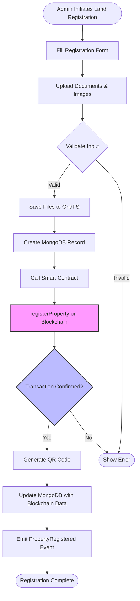

### Data Flow Diagram - Land Transfer/Sale

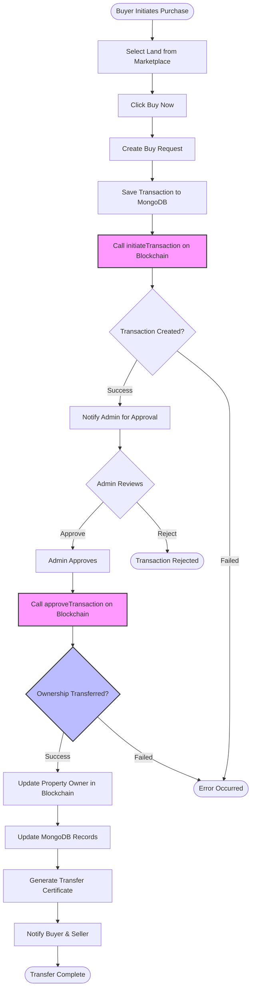

### System Integration Block Diagram

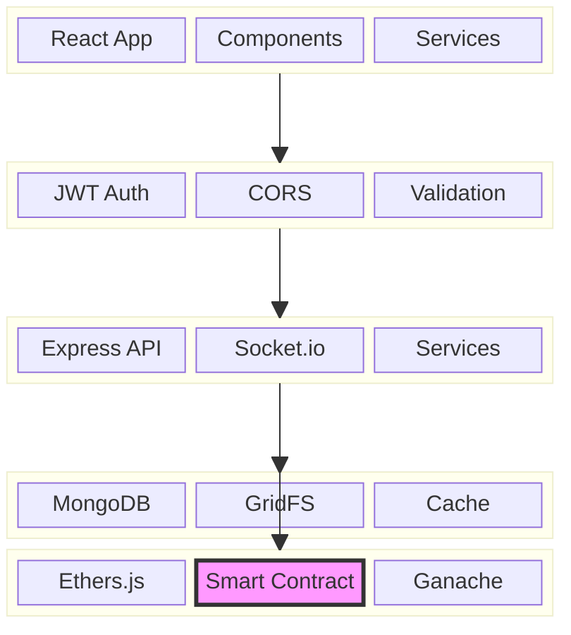

### Chatbot Architecture

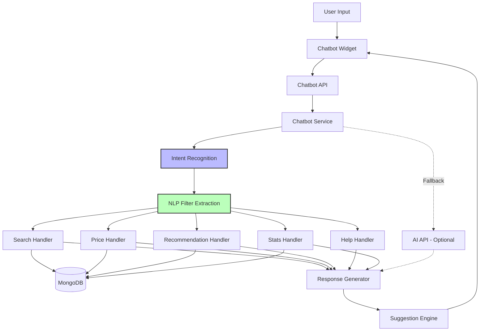

### Real-time Chat Architecture

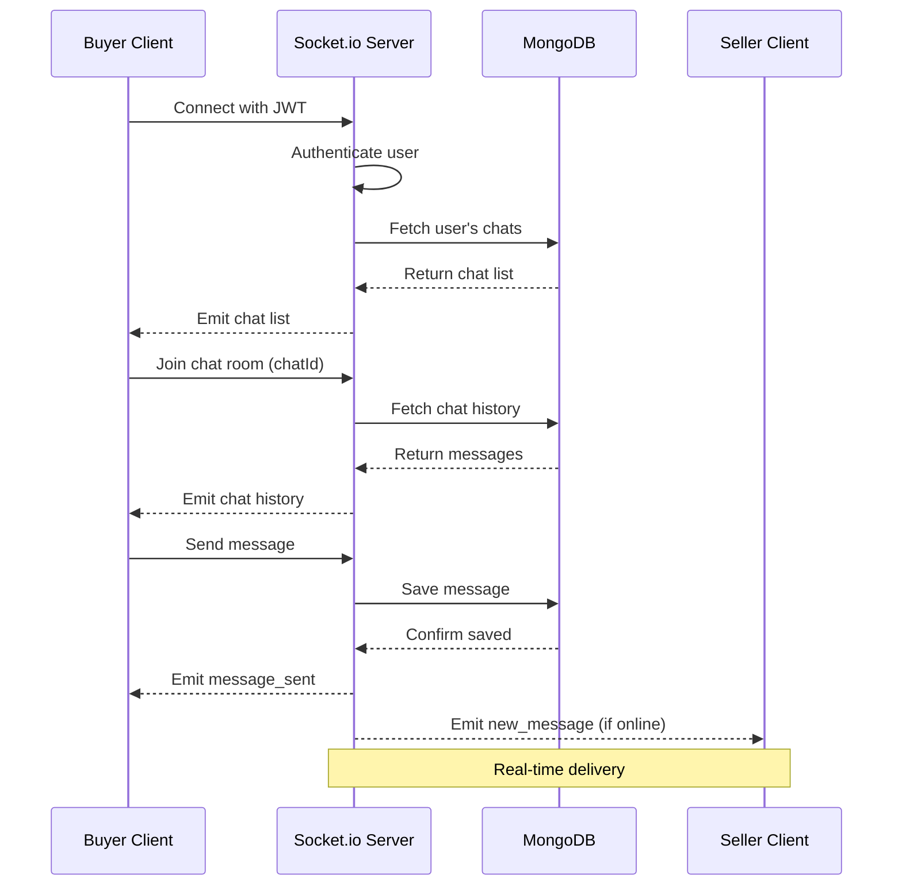

---

---

## 💻 Technology Stack

### Frontend
| Technology | Purpose |
|------------|---------|
| **React 18** | UI framework |
| **TypeScript** | Type-safe development |
| **Vite** | Build tool & dev server |
| **Tailwind CSS** | Utility-first styling |
| **Lucide React** | Icon library |
| **Axios** | HTTP client |
| **Socket.io Client** | Real-time communication |
| **React Router** | Client-side routing |
| **Leaflet** | Interactive maps |
| **QRCode** | QR code generation |

### Backend
| Technology | Purpose |
|------------|---------|
| **Node.js** | Runtime environment |
| **Express.js** | Web framework |
| **MongoDB** | NoSQL database |
| **Mongoose** | MongoDB ODM |
| **Socket.io** | WebSocket server |
| **JWT** | Authentication |
| **Bcrypt** | Password hashing |
| **Multer** | File uploads |
| **GridFS** | Large file storage |
| **Nodemailer** | Email service |

### Blockchain
| Technology | Purpose |
|------------|---------|
| **Solidity ^0.8.19** | Smart contract language |
| **Hardhat** | Development environment |
| **Ethers.js** | Ethereum library |
| **Ganache** | Local blockchain |

### AI & Optional Services
| Technology | Purpose |
|------------|---------|
| **Rule-based NLP** | Primary chatbot logic |
| **OpenAI API** | Optional AI fallback |
| **Google Gemini** | Optional AI fallback |
| **IPFS** | Optional decentralized storage |

---

## ✨ Core Features

### 1. **User Management**
- Multi-role authentication (Admin, User, Auditor)
- JWT-based session management
- Two-factor authentication (2FA) via email OTP
- Email verification for new accounts
- Password reset functionality

### 2. **Land Registry**
- Digital land record creation and management
- Blockchain-backed immutability
- QR code generation for quick verification
- Document upload (images, PDFs)
- Land classification (Agricultural, Residential, Commercial, Industrial)
- Geo-location mapping

### 3. **Marketplace**
- Browse available properties
- Advanced search and filtering
- Price-based sorting
- Land type filtering
- Location-based search
- Favorite/wishlist functionality

### 4. **AI Chatbot Assistant**
- **Hybrid Architecture**: Rule-based NLP + optional AI API
- **7 Built-in Intents**:
  - `SEARCH_LANDS`: Find properties by criteria
  - `PRICE_INQUIRY`: Get price statistics
  - `RECOMMENDATION`: AI-powered suggestions
  - `LOCATION_QUERY`: Location-based search
  - `HELP`: User assistance
  - `STATS`: Market statistics
  - `COMPARISON`: Compare properties
- User-specific chat history
- Contextual suggestions
- Interactive land cards with "View Details" buttons
- Persistent chat across sessions

### 5. **Real-time Communication**
- Socket.io-powered chat system
- Buyer-seller messaging
- Land-specific chat threads
- Message history persistence
- Online/offline status indicators

### 6. **Transaction Management**
- Blockchain-recorded transactions
- Admin approval workflow
- Transaction history tracking
- Digital certificate generation
- Ownership transfer records

### 7. **Admin Dashboard**
- User verification management
- Land record approval
- Transaction oversight
- Audit log viewing
- System statistics

---

## 📊 System Flowcharts

### User Registration & Authentication Flow

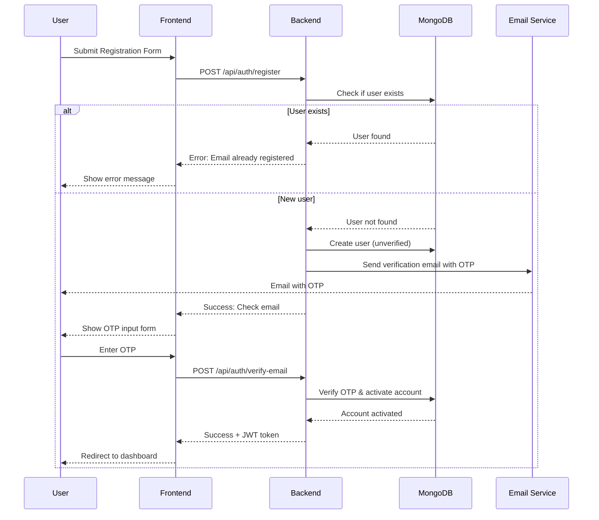

### Land Registration Flow

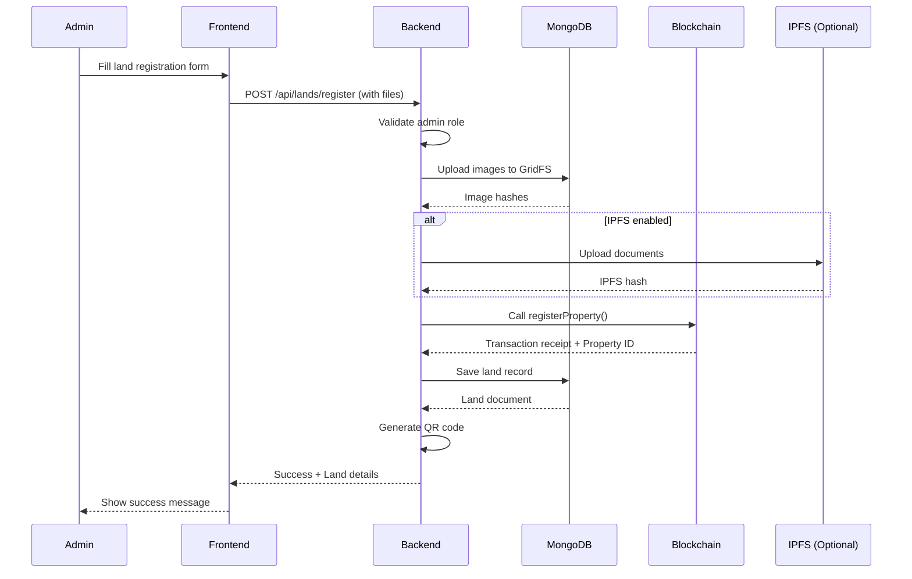

### Property Search via Chatbot Flow

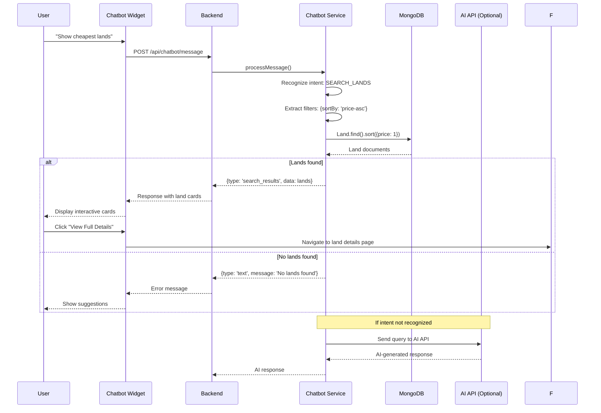

### Real-time Chat Flow

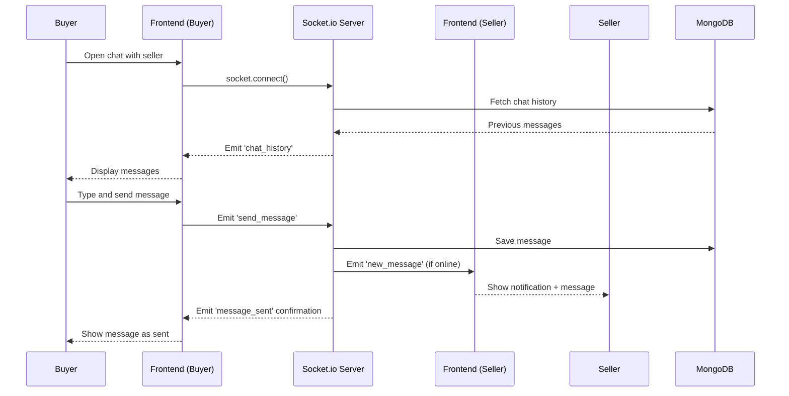

### Land Purchase Transaction Flow

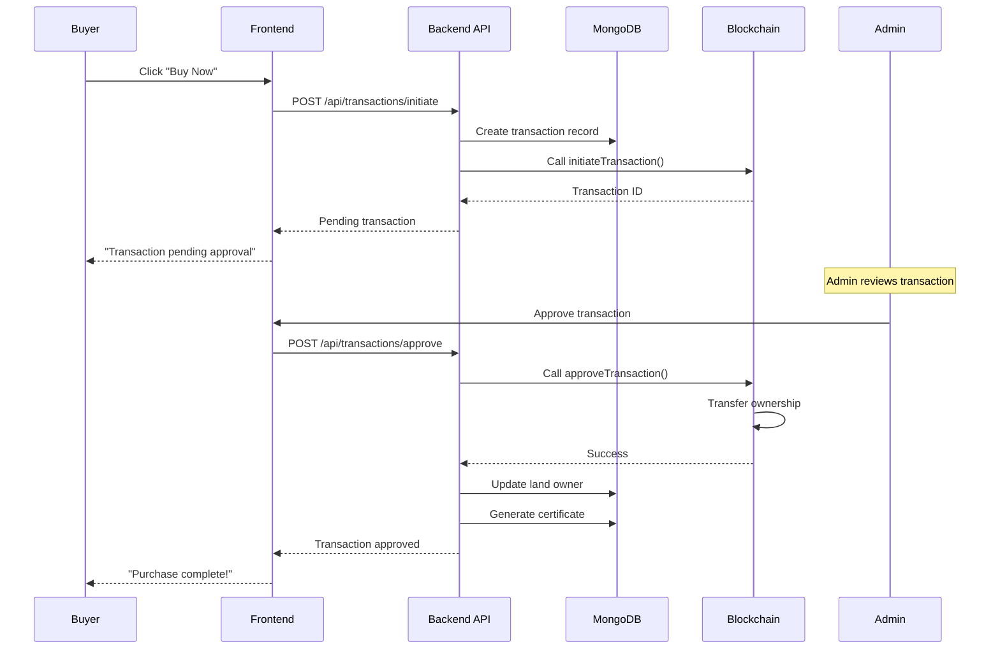

---

## 🗄️ Database Schema

### User Collection
```javascript
{
  _id: ObjectId,
  fullName: String,
  email: String (unique, indexed),
  password: String (hashed),
  role: Enum ['USER', 'ADMIN', 'AUDITOR'],
  phone: String,
  address: {
    street: String,
    city: String,
    state: String,
    pincode: String
  },
  verificationStatus: Enum ['PENDING', 'VERIFIED', 'REJECTED'],
  isEmailVerified: Boolean,
  twoFactorEnabled: Boolean,
  twoFactorSecret: String,
  emailOTP: {
    code: String,
    expiresAt: Date
  },
  createdAt: Date,
  updatedAt: Date
}
```

### Land (DigitizedLand) Collection
```javascript
{
  _id: ObjectId,
  surveyNumber: String (unique, indexed),
  assetId: String (unique),
  landType: Enum ['AGRICULTURAL', 'RESIDENTIAL', 'COMMERCIAL', 'INDUSTRIAL'],
  area: {
    acres: Number,
    guntas: Number,
    sqft: Number
  },
  village: String,
  taluka: String,
  district: String (indexed),
  state: String,
  pincode: String,
  coordinates: {
    latitude: Number,
    longitude: Number
  },
  currentOwner: ObjectId (ref: 'User', indexed),
  previousOwners: [ObjectId],
  status: Enum ['AVAILABLE', 'FOR_SALE', 'SOLD', 'DISPUTED'],
  verificationStatus: Enum ['PENDING', 'VERIFIED', 'REJECTED'],
  marketInfo: {
    isForSale: Boolean (indexed),
    askingPrice: Number (indexed),
    description: String,
    features: [String],
    nearbyAmenities: [String],
    images: [String], // GridFS file IDs
    virtualTourUrl: String,
    listedAt: Date,
    listedDate: Date
  },
  documents: {
    propertyDeed: String, // GridFS file ID
    taxReceipts: [String],
    surveyDocuments: [String]
  },
  blockchainData: {
    propertyId: Number,
    transactionHash: String,
    blockNumber: Number
  },
  qrCode: String, // Base64 encoded QR
  createdAt: Date,
  updatedAt: Date
}
```

### Chat Collection
```javascript
{
  _id: ObjectId,
  landId: ObjectId (ref: 'DigitizedLand', indexed),
  participants: [ObjectId] (ref: 'User', indexed),
  messages: [{
    sender: ObjectId (ref: 'User'),
    content: String,
    timestamp: Date,
    read: Boolean
  }],
  lastMessage: {
    content: String,
    timestamp: Date,
    sender: ObjectId
  },
  createdAt: Date,
  updatedAt: Date
}
```

### Transaction Collection
```javascript
{
  _id: ObjectId,
  landId: ObjectId (ref: 'DigitizedLand'),
  from: ObjectId (ref: 'User'),
  to: ObjectId (ref: 'User'),
  transactionType: Enum ['REGISTRATION', 'SALE', 'TRANSFER', 'RENT'],
  amount: Number,
  status: Enum ['PENDING', 'APPROVED', 'REJECTED'],
  approvedBy: ObjectId (ref: 'User'),
  blockchainData: {
    transactionHash: String,
    blockNumber: Number,
    gasUsed: Number
  },
  certificate: {
    certificateId: String,
    pdfHash: String, // GridFS file ID
    issuedAt: Date
  },
  createdAt: Date,
  updatedAt: Date
}
```

---

## 🔌 API Documentation

### Authentication Endpoints

| Method | Endpoint | Description | Auth Required |
|--------|----------|-------------|---------------|
| POST | `/api/auth/register` | Register new user | No |
| POST | `/api/auth/login` | User login | No |
| POST | `/api/auth/verify-email` | Verify email with OTP | No |
| POST | `/api/auth/resend-otp` | Resend verification OTP | No |
| POST | `/api/auth/forgot-password` | Request password reset | No |
| POST | `/api/auth/reset-password` | Reset password with token | No |
| GET | `/api/auth/me` | Get current user | Yes |
| POST | `/api/auth/enable-2fa` | Enable 2FA | Yes |
| POST | `/api/auth/verify-2fa` | Verify 2FA code | Yes |

### Land Management Endpoints

| Method | Endpoint | Description | Auth Required | Role |
|--------|----------|-------------|---------------|------|
| POST | `/api/lands/register` | Register new land | Yes | Admin |
| GET | `/api/lands` | Get all lands | Yes | Any |
| GET | `/api/lands/:id` | Get land by ID | Yes | Any |
| PUT | `/api/lands/:id` | Update land details | Yes | Admin/Owner |
| DELETE | `/api/lands/:id` | Delete land record | Yes | Admin |
| POST | `/api/lands/:id/list` | List land for sale | Yes | Owner |
| PUT | `/api/lands/:id/unlist` | Remove from marketplace | Yes | Owner |
| GET | `/api/lands/marketplace` | Get marketplace listings | Yes | Any |
| POST | `/api/lands/:id/verify` | Verify land via QR | Yes | Any |

### Chatbot Endpoints

| Method | Endpoint | Description | Auth Required |
|--------|----------|-------------|---------------|
| POST | `/api/chatbot/message` | Send message to chatbot | Yes |
| GET | `/api/chatbot/suggestions` | Get contextual suggestions | Yes |
| GET | `/api/chatbot/stats` | Get chatbot usage stats | Yes |

### Chat Endpoints

| Method | Endpoint | Description | Auth Required |
|--------|----------|-------------|---------------|
| GET | `/api/chats` | Get user's chats | Yes |
| GET | `/api/chats/:id` | Get specific chat | Yes |
| POST | `/api/chats` | Create new chat | Yes |
| POST | `/api/chats/:id/messages` | Send message | Yes |
| PUT | `/api/chats/:id/read` | Mark messages as read | Yes |

### Transaction Endpoints

| Method | Endpoint | Description | Auth Required | Role |
|--------|----------|-------------|---------------|------|
| POST | `/api/transactions/initiate` | Initiate transaction | Yes | Owner |
| GET | `/api/transactions` | Get all transactions | Yes | Admin |
| GET | `/api/transactions/:id` | Get transaction details | Yes | Any |
| POST | `/api/transactions/:id/approve` | Approve transaction | Yes | Admin |
| POST | `/api/transactions/:id/reject` | Reject transaction | Yes | Admin |
| GET | `/api/transactions/certificate/:id` | Download certificate | Yes | Any |

### Socket.io Events

| Event | Direction | Description | Data |
|-------|-----------|-------------|------|
| `connection` | Client → Server | Establish connection | - |
| `join_chat` | Client → Server | Join chat room | `{chatId}` |
| `send_message` | Client → Server | Send message | `{chatId, content}` |
| `new_message` | Server → Client | Receive new message | `{message}` |
| `message_sent` | Server → Client | Confirm message sent | `{messageId}` |
| `chat_history` | Server → Client | Load chat history | `{messages[]}` |
| `user_online` | Server → Client | User came online | `{userId}` |
| `user_offline` | Server → Client | User went offline | `{userId}` |
| `disconnect` | Client → Server | Close connection | - |

---mermaid
graph TB
    subgraph "Frontend Layer"
        A[React + TypeScript + Vite]
        A1[Dashboard]
        A2[Marketplace]
        A3[AI Chatbot Widget]
        A4[Real-time Chat]
        A5[Land Details]
        A --> A1
        A --> A2
        A --> A3
        A --> A4
        A --> A5
    end

    subgraph "Backend Layer"
        B[Express.js Server]
        B1[REST API Routes]
        B2[Socket.io Server]
        B3[Authentication Middleware]
        B4[File Upload Handler]
        B --> B1
        B --> B2
        B --> B3
        B --> B4
    end

    subgraph "Data Layer"
        C[MongoDB Database]
        C1[User Collection]
        C2[Land Collection]
        C3[Transaction Collection]
        C4[Chat Collection]
        C5[GridFS Storage]
        C --> C1
        C --> C2
        C --> C3
        C --> C4
        C --> C5
    end

    subgraph "Blockchain Layer"
        D[Ethereum Network]
        D1[LandRegistry Smart Contract]
        D2[Hardhat/Ganache]
        D --> D1
        D --> D2
    end

    subgraph "External Services"
        E1[Email Service - Nodemailer]
        E2[IPFS - Optional]
        E3[AI APIs - Optional]
    end

    A --> B
    B --> C
    B --> D
    B --> E1
    B --> E2
    B --> E3
